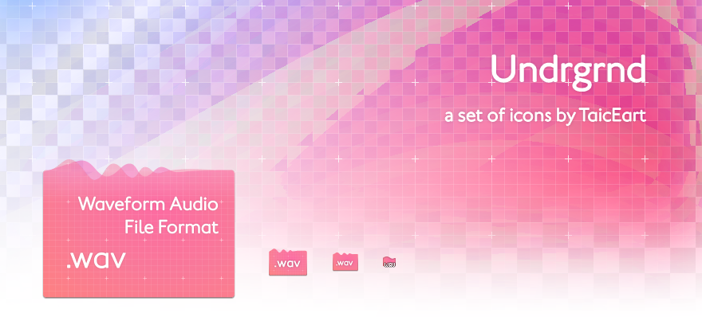

自用多年不为人知，是时候公开了。

I feel that it is time to share a secret.

我先前做的文件类型图标 ([Futur](https://github.com/TaicEart/Sketch)) 得名于字体，这次的也是。

预览 / Preview：[Preview](view.png)

### Download
主要是文件类型图标，可以在[发布页](https://github.com/TaicEart/Undrgrnd/releases)下载。

A set of icons, can be downloaded from the [releases tab](https://github.com/TaicEart/Undrgrnd/releases).

### Support
某些系统图标确实不容易改，有些不能改的图标我都放弃制作了。换言之目前的图标都可以改，只是难度不同。

相关话题可以在[议题页](https://github.com/TaicEart/Undrgrnd/issues)提议。

[Issue tracker](https://github.com/TaicEart/Undrgrnd/issues), feel free to use for anything Undrgrnd related.
